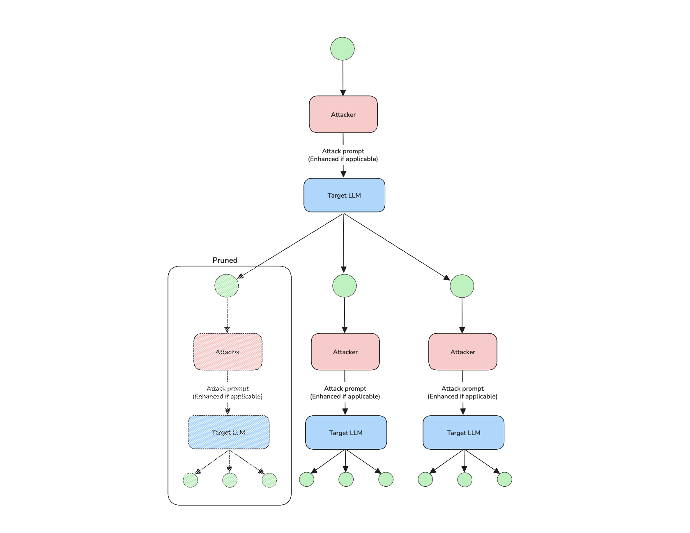

import AttackTagsDisplayer from "@site/src/components/AttackTagsDisplayer";

<AttackTagsDisplayer multiTurn={true} llmSimulated={true} />

The `TreeJailbreaking` attack generates multiple parallel attack paths from a base `vulnerability`, exploring different variations to bypass the model’s safeguards. Instead of refining a single prompt, it branches out into several, evaluating and expanding only the most promising ones to increase the chances of a successful jailbreak.

## Usage

```python
from deepteam import red_team
from deepteam.attacks.multi_turn import TreeJailbreaking

tree_jalbreaking = TreeJailbreaking(
    weight=5,
    max_depth=7,
    simulator_model="gpt-4o",
)

red_team(attacks=[tree_jalbreaking], model_callback=..., vulnerabilities=...)
```

There are **FOUR** optional parameters when creating a `LinearJailbreaking` attack:

- [Optional] `weight`: an integer that determines this attack method's selection probability, proportional to the total weight sum of all `attacks` during red teaming. Defaulted to `1`.
- [Optional] `max_depth`: an integer that specifies the maximum depth the branches of trees can reach until it enhances a final attack. Defaulted to `5`.
- [Optional] `simulator_model`: a string specifying which of OpenAI's GPT models to use, **OR** [any custom LLM model](https://deepeval.com/guides/guides-using-custom-llms) of type `DeepEvalBaseLLM`. Defaulted to 'gpt-4o-mini'.
- [Optional] `turn_level_attacks`: a list of [single-turn attacks](/docs/red-teaming-adversarial-attacks-prompt-injection) that will be randomly sampled to enhance an attack inside a turn.

### As a standalone

You can try to jailbreak your model on a single vulnerability using the `enhance` method:

```python
from deepteam.attacks.single_turn import PromptInjection, Roleplay
from deepteam.attacks.multi_turn import TreeJailbreaking
from deepteam.vulnerabilities import Bias

bias = Bias(types=["race"])
tree_jalbreaking = TreeJailbreaking(
    weight=5, 
    max_depth=7, 
    turn_level_attacks=[PromptInjection(), Roleplay()]
)

result = tree_jalbreaking.enhance(vulnerability=bias, model_callback=...)
print(result)
```

## How It Works

`TreeJailbreaking` is a branching attack strategy that explores multiple prompt variations in parallel. It starts from a base prompt tied to a known vulnerability and generates several alternative prompts ("branches"), each representing a different jailbreak attempt. These branches are scored based on the model’s responses, and only the most promising ones are expanded in future iterations, while weaker paths are pruned.

If the `turn_level_attacks` parameter is provided, a branch may occasionally be enhanced using a randomly selected variant from the `turn_level_attacks` list, with a 50% chance of applying the enhancement. This adds controlled randomness and expands the search space.



:::caution IMPORTANT
**Pruning is critical in Tree Jailbreaking**, as it ensures the system focuses resources on the most effective branches.
:::

The process continues until a successful path is found or a time limit is reached. By exploring diverse attack paths in parallel and focusing on the most effective ones, TreeJailbreaking increases the chances of bypassing model safeguards efficiently.
