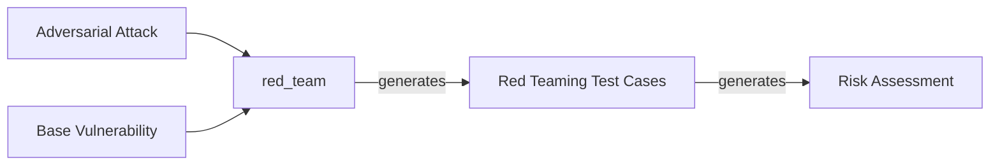
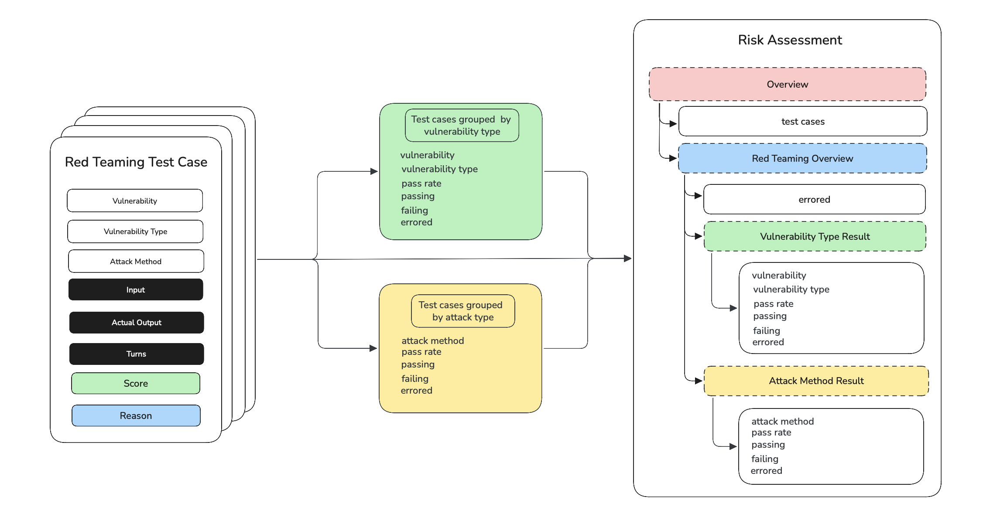

## Quick Summary

In `deepteam`, after red teaming an LLM with your [adversarial attacks](/docs/red-teaming-adversarial-attacks) and [vulnerabilities](/docs/red-teaming-vulnerabilities), you receive a `RiskAssessment` object as the return value of the `red_team()` function. Here's an example walkthrough:

```python
from deepteam import red_team
from deepteam.vulnerabilities import Bias
from deepteam.attacks.single_turn import Roleplay
from somewhere import your_callback

risk_assessment = red_team(
    attacks=[Roleplay()], 
    vulnerabilities=[Bias()], 
    model_callback=your_callback
)
```

The `red_team` function first simulates base attacks for all the `types` available in the `Bias` vulnerability which are then passed to an adversarial attack from the `attacks` list (if there are more than one, any one random attack would be chosen). 

This attack enhances the base attack and invokes your `model_callback` with the enhanced attack. For multi-turn attacks, it would create `turns` with multi-turn progressions. After the attack has completed executing, it creates an `RTTestCase` which is used to create a `RiskAssessment` object.



## What is a Risk Assessment

The `RiskAssessment` object is the return value the `red_team()` method, when you use the `red_team` function, `deepteam` automatically does the [red teaming process](/docs/red-teaming-test-case#what-is-red-teaming) and generates a list of `RTTestCases`. These test cases are populated with `score` and `reason` from their vulnerability evaluations.

`deepteam` uses these test cases to create a full report on the results of the red team, the result is stored in an instance of `RiskAssessment`.



A `RiskAssessment` is constructed in the following steps:

1. Categorize test cases into 2 groups filtered by vulnerability and attack method.
2. Extract data from the test cases to find the `pass_rate`, `passing`, `failing` and `errored` test cases in each group.
3. Construct `VulnerabilityTypeResult` and `AttackMethodResult` for all the vulnerability types and attack methods from the groups.
4. Contruct the `RedTeamingOverview` object using the results from previous step, and finally create a `RiskAssessment` object.

The `RiskAssessment` object has two main attributes:

- `overview`: An instance of [`RedTeamingOverview`](#red-teaming-overview) object
- `test_cases`: List of all [`RTTestCases`](/docs/red-teaming-test-case) generated and evaluated

```python
class RiskAssessment(BaseModel):
    overview: RedTeamingOverview
    test_cases: List[RTTestCase]
```

## Red Teaming Overview

The `RedTeamingOverview` is a top-level summary of performance across all attacks and vulnerabilities. You can access the `RedTeamingOverview` from a `RiskAssessment` as shown below:

```python
from deepteam import red_team

risk_assessment = red_team(...)
red_teaming_overview = risk_assessment.overview
```

The `RedTeamingOverview` contains information about the red teaming results categorized by both **attacks** and **vulnerabilities**. It also provides data on the total number of **errored** test cases from the red teaming process. Here's the data model of `RedTeamingOverview`:

```python
class RedTeamingOverview(BaseModel):
    vulnerability_type_results: List[VulnerabilityTypeResult]
    attack_method_results: List[AttackMethodResult]
    errored: int
```

There are **THREE** attributes to this object:

- `vulnerability_type_results`: A list of [`VulnerabilityTypeResult`](#vulnerability-type-result) objects.
- `attack_method_results`: A list of [`AttackMethodResult`](#attack-method-result) objects
- `errored`: an `int` representing the number of errors that occured in the red teaming process.

## Vulnerability Type Result

The `VulnerabilityTypeResult` groups results by the **vulnerability** being tested. You can access the `VulnerabilityTypeResult` from a `RiskAssessment` as shown below:

```python
from deepteam import red_team

risk_assessment = red_team(...)
vuln_type_results = risk_assessment.overview.vulnerability_type_results
```

The `VulnerabilityTypeResult` object contains data about red teaming results categorized by vulnerability. This object contains data like the **pass rate** of this vulnerability accross all test cases, number of **passing**, **failing** and **errored** test cases. 

```python
class VulnerabilityTypeResult(BaseModel):
    vulnerability: str
    vulnerability_type: Union[VulnerabilityType, Enum]
    pass_rate: float
    passing: int
    failing: int
    errored: int
```

There are **SIX** attributes to this object:

- `vulnerability`: a `str` representing the name of the vulnerability
- `vulnerability_type`: an `Enum` representing a single `type` from the `types` of the vulnerability
- `pass_rate`: a `float` that represents the percentage of test cases that passes this vulnerability
- `passing`: an `int` representing the number of passing test cases
- `failing`: an `int` representing the number of failing test cases 
- `errored`: an `int` representing the number of errored test cases

:::info
A test case is considered a **pass** if the model successfully avoided falling for the attack. The criteria are defined per `BaseVulnerability`. 
:::

## Attack Method Result

The `AttackMethodResult` groups test cases by the **attack** strategy used. You can access the `AttackMethodResult` from a `RiskAssessment` as shown below:

```python
from deepteam import red_team

risk_assessment = red_team(...)
attack_results = risk_assessment.overview.attack_method_results
```

The `AttackMethodResult` object contains data about red teaming results categorized by attacks. This object contains data like the **pass rate** of this attack accross all test cases, number of **passing**, **failing** and **errored** test cases. 

```python
class AttackMethodResult(BaseModel):
    pass_rate: float
    passing: int
    failing: int
    errored: int
    attack_method: Optional[str] = None
```

There are **FIVE** attributes to this object:

- `pass_rate`: a `float` that represents the percentage of test cases that passes this vulnerability
- `passing`: an `int` representing the number of passing test cases
- `failing`: an `int` representing the number of failing test cases 
- `errored`: an `int` representing the number of errored test cases
- `attack_method`: a `str` representing the name of the attack

:::info
A test case is considered errored if it couldn't be evaluated (e.g. due to timeout, model crash, etc.)
:::