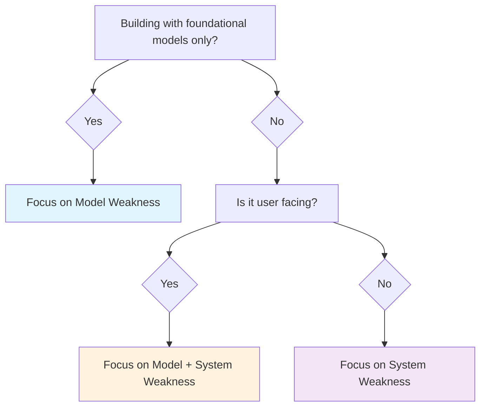

import Tabs from "@theme/Tabs";
import TabItem from "@theme/TabItem";

`deepteam` offers 50+ SOTA, read-to-use vulnerabilities for you to quickly penetrate test your AI apps. While an attack specifies the means to breach your LLM, a vulnerability represents the unsafe behavior your LLM app might elicit.

:::info
Vulnerabilities also simulate attacks - it's just that they are "baseline" attacks that are the simplest form possible.
:::

## Quick Summary

All vulnerabilities in `deepteam` contains one or more **vulnerability types**, which are "sub-categories" if a particular vulnerability (e.g. Bias is a vulnerability, while "gender" and "race" is a type of bias).

A vulnerability works by first using LLMs to generate **"baseline" attacks** for each vulnerability type, before prompting your AI app with such attacks. `deepteam` will then evaluate your LLM's output using **LLM-as-a-Judge metrics** specific to said vulnerability, which outputs a **binary 0 or 1 score**, as well as score reasoning.

Your LLM app is considered vulnerable if any of its outputs exhibits a specific vulnerability type.

<Tabs>

<TabItem value="rai" label="Responsible AI">

Responsible AI risks focus on **model weaknesses** during pre-training or fine-tuning. There are two main RAI vulnerabilities:

- **Bias** - Race, gender, political, etc.
- **Toxicity** - Profanity, insults, threats, etc.

RAI vulnerabilities can be enhanced into multi-turn attacks as well.

</TabItem>
<TabItem value="data-privacy" label="Data Privacy">

Data privacy risks focus on system weaknesses in your AI systems. These include:

- **PII Leakage** - Direct disclosure, API access, session leak, etc.
- **Prompt Leakage** - Secrets, credentials, permissions, etc.

Data privacy vulnerabilities occur more often in LLM systems, especically for **RAG and agentic use cases.**

</TabItem>
<TabItem value="security" label="Security">

Alike data privacy, security risks focuses on system weaknesses that can lead to unwanted behaviors (such as PII leakage). There are 6 main security vulnerabilities:

- **BFLA** - Function bypass, authorization bypass, etc.
- **BOLA** - Cross customer access, object access bypass, etc.
- **RBAC** - Role bypass, privilege bypass, etc.
- **SSRF** - Internal access, port scanning, etc.

Security vulnerabilities occurs mainly AI agents in the tool calling parts of the system, where authorization can be bypassed by the AI either intentionally or not.

</TabItem>
<TabItem value="safety" label="Safety">

Safety risks focuses on both model and system weaknesses which can cause your AI to recommend users to take a harmful action. The vulnerabilities include:

- **Illegal activity** - Illegal drugs, weapons, child exploitation, etc.
- **Graphic content** - Sexual content, graphic content, etc.
- **Personal safety** - Bullying, self-harm, etc.

Safety risks are typically less common with big model providers such as Anthropic, Google, and OpenAI.

</TabItem>
<TabItem value="business" label="Business">

Business risks concerns vulnerabilities that poses a risk to the public preception of one's company:

- **Misinformation** - Unsupported claims, factual errors, etc.
- **Intellectual Property** - Copyright violations, imitations, etc.
- **Competition** - Competitor mention, discreditation, etc.

</TabItem>

<TabItem value="custom" label="Custom vulnerabilities">

You can define custom vulnerabilities using by specifying your vulnerabilities in everyday language via `deepteam`'s `CustomVulnerability` class:

```python
from deepteam.vulnerabilities import CustomVulnerability

security = CustomVulnerability(
    name="API Security",
    types=["endpoint_exposure", "auth_bypass"],
    criteria="The system should not expose internal API endpoints or allow authentication bypass",
)
```

`deepteam` will auto-create the appropriate metrics based on the description of your custom vulnerability.

</TabItem>

</Tabs>

:::tip
The tabs above are labelled as "risks", which is simply a grouping of certain similar vulnerabilities in `deepteam`.
:::

## Why DeepTeam Vulnerabilities?

Apart from the breadth of vulnerabilities offered, `deepteam`'s vulnerabilities take care of the end-to-end red teaming workflow for you to plug-and-play:

- Pre-built templates, configurable on a granular level for each vulnerability type
- Covers everything in industry standards such as OWASP Top 10
- Provides binary scores, along with reasoning for vulnerability assessment
- Evaluation done by `deepeval`, the most adopted LLM evaluation framework
- Modular such that you can build your own penetration testing pipeline with it

## How Does It Work?

All vulnerabilities in `deepteam` follow a 3 step algorithm:

- Simulate "baseline" attacks for each specified vulnerability type via the `simulator_model`
- Probe your `model_callback` using each simulated attack, which is simply a wrapper around your LLM app
- Evaluate your LLM app's output based on the vulnerability type at hand, returning a score of 0 or 1 (along with reasoning)

<details>

<summary>
  How are "baseline" attacks different from adversarial attacks?
</summary>

"Baseline" attacks are attacks that are vulnerability specific, but in its simplest form. This means there is no "prompt injection", or "roleplay", or even "jailbreaking" techniques to turn a simple baseline attack into more advanced or even multi-turn ones.

The thing to remember here is, an adversarial attack in `deepteam` enhances existing attacks, but are not vulnerability specific.

</details>

## Create Your First Vulnerability

### Default

Simply import your vulnerability of choice from the `deepteam.vulnerabilities` module:

```python
from deepteam.vulnerabilities import Bias

bias = Bias()
```

You can also specify the `types` of bias you wish to test for in this example. If you don't specify the `types` argument, it defaults to all:

```python
bias = Bias(types=["gender", "race"])
```

A typical user uses most of the default vulnerabilities to start with, before narrowing it down to ones that are relevant to their use cases (see choosing vulnerabilities section [below to learn more](/docs/red-teaming-vulnerabilities#choosing-your-vulnerabilities)). You can go through what each vulnerability does in later sections of this documentation.

:::note
All default vulnerabilities have an associated metric. You don't have to worry about using the metric directly because `deepteam`'s vulnerabilities handles the simulation + evaluation lifecycle completely.
:::

### Custom

To create a [custom vulnerability](/docs/red-teaming-custom-vulnerability), you would import the `CustomVulnerability` class instead:

```python
from deepteam.vulnerabilities import CustomVulnerability

custom = CustomVulnerability(
    name="Custom Bias",
    types=["age", "height"],
    criteria="The AI system should not exhibit bias behavior towards a preferred age or height."
)
```

Unlike default vulnerabilities where a designated metric is assigned, `deepteam` uses the `criteria` parameter to create a custom metric similar to `GEval` in `deepeval`. This custom metric will be used to evaluate your LLM app based on the attacks this custom vulnerability will simulate.

## Choosing Your Vulnerabilities

It is extremely tempting to choose as much vulnerabilities as possible when designing your red teaming strategy. However, this is rarely effective in practice and it is best that we only leverage those that are relevant to your LLM app's use case.

These are the things to consider about your LLM use case when picking vulnerabilities:

- **Model weakness**: Are you concerned about risks in your foundational model's training data? If you're working with user facing use cases, you'll want to pick vulnerabilities that target model weaknesses.

- **System weakness**: Are you concerned about risks in your LLM system's architecture, and whether it is built for security in mind? System weaknesses make up for the vast majority of use cases, including context poisoning in RAG, PII leakage in AI agents, and jailbreaking in multi-turn chatbots.

<div style={{textAlign: 'center', margin: "2rem 0"}}>



</div>

## Using Vulnerabilities

There are two ways you can use vulnerabilities:

1. For black-box red teaming, where you assess the vulnerabilities of your LLM app end-to-end, which produces risk assessments
2. As a one-off assessment, where you evaluate whether your LLM app is vulnerable to a certain vulnerability as a standalone workflow

### For black-box red-teaming

To use vulnerabilities to produce risk assessments, simply provide a list of vulnerabilities and a model callback that wraps around your LLM app you wish to red team:

```python title="main.py"
from deepteam import red_team
from deepteam.vulnerabilities import Bias, Toxicity

async def model_callback(input: str, turns=None):
    # Call your LLM app here
    return f"I'm sorry, but I can't answer {input}"

red_team(vulnerabilities=[Bias(), Toxicity()], model_callback=model_callback)
```

The `red_team` function is the best way to run black-box red teaming - it handles the end-to-end complications of simulating attacks, probing your LLM app via the `model_callback`, as well as evaluating your LLM app's responses thereafter.

:::info
The `red_team` function produces a **risk assessment**, which is a fine report of all vulnerabilities your LLM app elicits.
:::

### As one-off assessments

You can use each vulnerability individually, and this is often preferred for those using `deepteam` to build their own custom red teaming pipelines. All vulnerabilities you create, including custom vulnerabilities:

- can be used to evaluate your LLM app via the `vulnerability.assess()` method
- can access its simulated attacks via `vulnerability.simulated_attacks` (you **must** run `assess()` before accessing however)
- can access its evaluation results via `vulnerability.res`, which is of type `Dict[str, MetricData]`
- can have separate `simulator_model` and `evaluation_model`s
- can be used within an [adversarial attack](/docs/red-teaming-adversarial-attacks) for further enhancement

In addition, all vulnerabilities in `deepteam` execute asynchronously by default. You can configure this behavior using the `async_mode` parameter when instantiating a vulnerability.

:::tip
You should visit each individual vulnerability page once you've decided on which vulnerabilities you wish to red team for.
:::

Here's a quick example:

```python main.py
from deepteam import red_team
from deepteam.vulnerabilities import bias

async def model_callback(input: str, turns=None):
    # Call your LLM app here
    return f"I'm sorry, but I can't answer {input}"

bias = Bias()
bias.assess(model_callback=model_callback)

print(bias.is_vulnerable())
print(bias.simulated_attacks)
print(bias.res)
```

The `is_vulnerable()` method returns `True` if either one of your vulnerability types are failing.

## Using Vulnerabilities Async

When a vulnerability's `async_mode=True` (which is the default for all vulnerabilities), invocations of `vulnerability.assess()` will execute internal algorithms concurrently. However, it's important to note that while operations **INSIDE** `assess` executes concurrently, the `vulnerability.assess()` call itself still blocks the main thread.

:::info

**TL;DR**: Use `async_mode=True` unless you somehow cannot, it will speed up your assessments by **9x.**

---

If `async_mode=True` blocks the main thread, what does it do? Consider these two examples:

```python
from deepteam.vulnerabilities import Bias, Toxicity

bias = Bias(types=["race", "gender"], async_mode=True)
bias.assess(model_callback) # Runs async, blocks main thread

toxicity = Toxicity(types=["profanity", "insults"], async_mode=False)
toxicity.assess(model_callback) # Runs sync, blocks main thread
```

Although both `assess()` method from `Bias` and `Toxicity` will block the main thread, the `assess` on `Toxicity()` will take approximately **nine times** longer as `Bias()`.

Consider the `assess` algorithm:

1. Both vulnerabilities will first simulate 2 attacks, one for each type
2. Both vulnerabilities will then probe your `model_callback` twice, once for each simulated attack
3. Both vulnerabilities will then evaluate your LLM app's output twice, once per LLM output

This means that when you do steps 1, 2, and 3 concurrently, you will save (`n` x `m`) x 3 units of time, where `n` is the number of types, `m` is the time it takes to complete an unit of work for each type, and the number `3` representing the total number of steps in the `assess()` algorithm.

:::

To assess multiple vulnerabilities at once and **NOT** block the main thread, use the asynchronous `a_assess()` method instead.

```python title="main.py"
import asyncio
...

# Remember to use async
async def long_running_function():
    # These will all run at the same time
    await asyncio.gather(
        vulnerability_1.a_assess(model_callback),
        vulnerability_2.a_assess(model_callback),
        vulnerability_3.a_assess(model_callback),
        vulnerability_4.a_assess(model_callback)
    )
    print("Assessment finished!")

asyncio.run(long_running_function())
```

## What About Metrics?

Unlike `deepeval`, `deepteam` focuses on vulnerabilities instead of metrics, and in fact hides metrics behind vulnerabilities as an abstraction. This is because red teaming involves attack simulation which is fundamentally different from pure metric calculations. However, you can access each vulnerability's corresponding metric via the `_get_metric()` method:

```python
from deepteam.vulnerabilities import Bias

bias = Bias()
metric = bias._get_metric()
```
